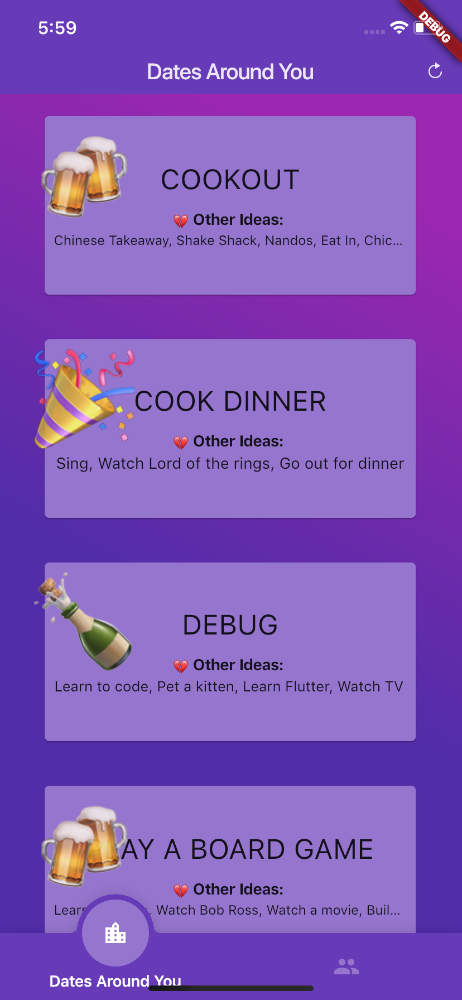
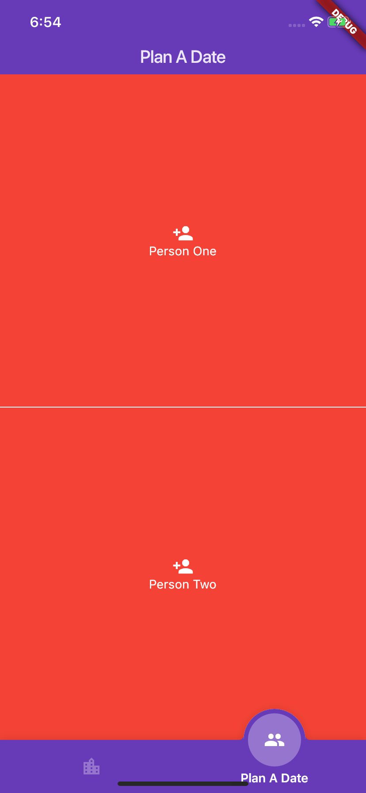
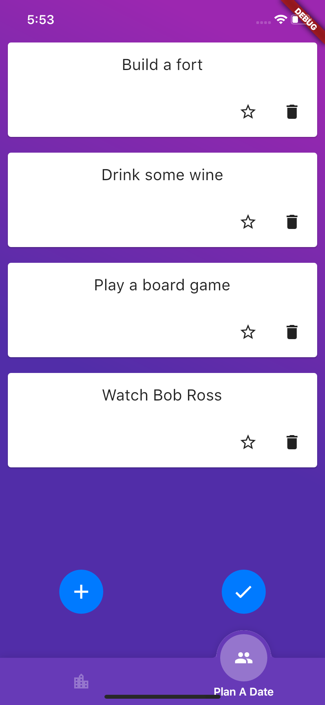
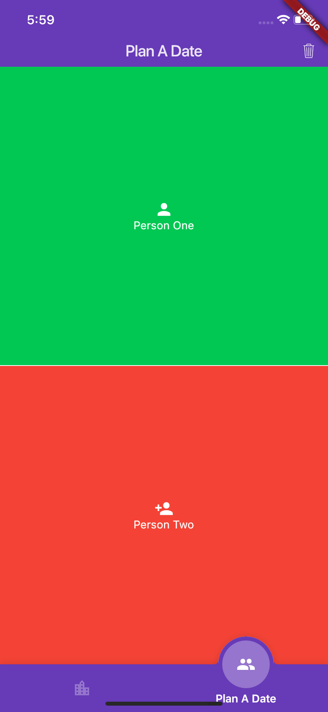
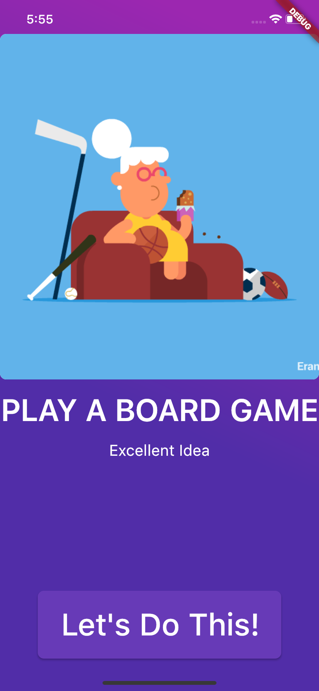

# Date Night

Date Night is a flutter based cross-platform mobile app designed to make your relationship easier.

Can't decide what to have for dinner? 
Can't choose a movie to watch?
What you want to do with the last hour before bed?

Date Night is there to help

| Home Screen  | Add Date     |              |              |  Results     |
| ------------ | ------------ | ------------ | ------------ | ------------ |
| Dates from other users |    |              |              |              |
|  |  |  |  |  |

# Key Features:
  - See dates happening around you
  - Enter in your date ideas, and Date Night will pick the right one for you

# New Features!

  - Automatically uploads ideas to Firebase so other couples can get help deciding

### Tech

Date Night uses a number of open source projects to work properly:

* [Dart] - A language optimized for client-side development for web and mobile.
* [Flutter] - Google's mobile UI framework for crafting high-quality native experiences on iOS and Android 
* [Firebase] - Google's mobile platform that helps you quickly develop high-quality apps 
* The template is based on GeekyAnt's [flutter-starter]

   [Dart]: <https://www.dartlang.org/>
   [Flutter]: <https://flutter.io/>
   [Firebase]: <https://firebase.google.com/>
   [flutter-starter]: <https://github.com/GeekyAnts/flutter-starter>
